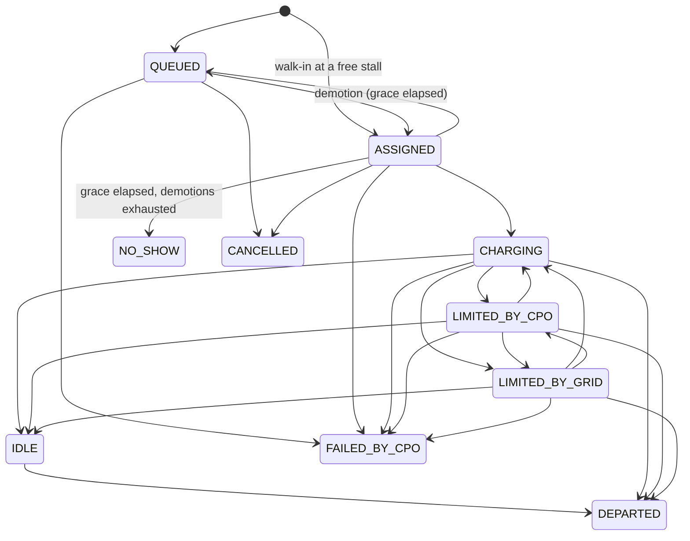

# EV Charging uc2 — Settlement-first Design

Status: **implemented** — all seven Arazzo workflows pass; 31 OPA unit tests pass.

This use case turns the ideas in [Thoughts on an interoperable EV charging network](https://ameetdesh.blogspot.com/2026/09/thoughts-on-interoperable-ev-charging.html) and its [technical blueprint](https://github.com/ameetdesh/ameetdesh.github.io/blob/main/writeups/ideas-to-improve-ev-charging-network.md) into a runnable devkit on Beckn v2.0 LTS and the latest `onix-adapter-deg`. It keeps the blueprint's core claims and simplifies the wire model wherever a simpler shape says the same thing.

## 1. What this devkit demonstrates

One scarce resource, the **charger-minute**, is sold under two contract modes that share one virtual queue:

| Mode | What the driver buys | What the CPO guarantees |
|---|---|---|
| `WALK_IN` | A place in the queue, starting now | FIFO assignment, a grace period, demotion by one slot (not to the back) |
| `RESERVATION` | A start time, booked ahead, for a fee | Stall ready by the reserved start (within grace), or the fee is refunded and delay is credited |

After the session, a **shared contract policy** (rego), referenced from the contract itself, computes the invoice from the session ledger alone, on both sides of the wire. A **network policy** rejects malformed ledgers and rule-breaking requests (for example, a reservation made less than 60 minutes ahead) with a NACK.

In scope: discovery, quote, booking, virtual queue with demotion, session ledger, settlement for both modes, reservation cancellation, grid (DR) derates as an attributed cause.

Deferred, with extension paths in §11: congestion fees, utilisation-gated idle fees, platform/network fees, tax, the CPO↔grid DR contract, broadcast forecasting telemetry, payment/escrow, cross-transaction anti-gaming rules.

## 2. Design principles

1. **Policy is code, terms are data.** The rego holds only formulas and invariants and is the same for every CPO. Prices, grace periods and caps are published per offer. CPOs compete on terms; the network standardises the rules. A new tier (GOLD, SILVER, fleet) is a new offer, not a new policy file.
2. **One fact, one place.** Attribution follows from the state name (`LIMITED_BY_GRID` means the grid is responsible), so there is no separate attribution column that could disagree with it. The current session state is the last ledger row, so no separate status field is needed.
3. **Make invariants structural where possible, check them where not.** The ledger is a transition log: each row starts where the previous one ends. That makes time conservation and contiguity true by construction. The stall is named on the `ASSIGNED` row, so single assignment is structural too. Checks remain only for what cannot be structural: legal transitions, enums, plausibility.
4. **Credits pay for time, not energy.** A derate or a fault does not take energy away; it delivers the energy later. Harm is measured as the extra minutes it caused, and the responsible party pays for those minutes.
5. **Standardise the rails, compete on the ride.** The scheduler, the forecaster and the DR bidding strategy stay inside the CPO. Only their *answers* cross the wire: a promised power and a start-time band.
6. **Copy, don't compose.** Each request is the previous response plus a small, named addition, which leaves implementers as little to decide as possible (§6).

## 3. Roles and participants

| Role | Beckn side | Subscriber (devkit) | Acts for |
|---|---|---|---|
| `driver` | BAP | `bap.example.com` | EV driver (via the charging app) |
| `cpo` | BPP | `bpp.example.com` | Charge point operator |

Settlement is between these two roles. The grid is a *cause* named in the ledger, not a party to this contract. The CPO↔grid DR contract is the [demand-flex](../../demand-flex/) shape and is out of scope here.

## 4. Object model — where everything lives

| Beckn slot | Schema (`@type`) | Written by | Carries |
|---|---|---|---|
| `catalog.resources[].resourceAttributes` | [EvChargingService v2.0](../../../specification/schema/EvChargingService/v2.0/) (`ChargingService`), reused; resolved from this fork, whose copy has a corrected `Location` `$ref` (§12) | CPO | A **charging pool**: site × connector × power class. Individual stalls are assigned later. |
| `catalog.offers[].offerAttributes` | **EvChargingOffer v3.0** (`ChargingOffer`), new | CPO | `mode`, `terms`, `contractAttributes` template |
| `contract.contractAttributes` | [DEGContract v2.0](../../../specification/schema/DEGContract/v2.0/), reused | copied from offer | roles + policy reference |
| `commitments[].resources[].quantity` | core | driver | energy needed, kWh |
| `commitments[].commitmentAttributes` | **EvChargingCommitment v1.0** (`ChargingCommitment`), new | driver adds `vehicle`, `reservedStart`; CPO adds `quote` | the request and the CPO's answer to it |
| `performance[].performanceAttributes` | **EvChargingSession v3.0** (`ChargingSession`), new | CPO | `ledger`, the session transition log |
| `consideration[id=settlement].considerationAttributes` | [RevenueFlow v2.0](../../../specification/schema/RevenueFlow/v2.0/), reused | injected by `contractpolicyenforcer` | itemised, net-zero revenue flows |

Three new schema versions. Everything else is reused.

### 4.1 EvChargingOffer v3.0 — `terms`

All amounts are in `terms.currency`, excluding tax. Every key is required for its mode; there are no hidden defaults.

| Key | Unit | Meaning |
|---|---|---|
| `currency` | ISO 4217 | Currency of every amount |
| `energyPerKWh` | /kWh | Energy tariff on metered kWh |
| `occupancyPerMin` | /min | Stall rent for minutes the driver is responsible for |
| `idlePerMin` | /min | Idle fee after charging ends, beyond `graceMin` |
| `graceMin` | min | Slack for the driver to arrive after assignment and to unplug after charging, and slack for the CPO to be ready after a reserved start |
| `maxDemotions` | count | Missed assignments allowed before `NO_SHOW` |
| `gridDelayCreditPerMin` | /min | Credit per minute a grid event added to the session |
| `reservation.fee` | amount | Reservation premium (RESERVATION only) |
| `reservation.cancelBeforeMin` | min | Free cancellation up to this many minutes before `reservedStart` |
| `reservation.cpoDelayCreditPerMin` | /min | Credit per minute of CPO-caused delay |
| `reservation.liabilityCap` | amount | Cap on the CPO delay credit |

`mode` is explicit so that discovery filters and humans can read it directly. The network policy checks that `mode` and the presence of the `reservation` block agree.

### 4.2 EvChargingCommitment v1.0

```json
"commitmentAttributes": {
  "@context": ".../EvChargingCommitment/v1.0/context.jsonld", "@type": "ChargingCommitment",
  "vehicle": {"maxChargeKW": 60, "socPercent": 22},
  "reservedStart": "2026-10-02T18:00:00Z",
  "quote": {"promisedKW": 60, "estimatedStart": {"from": "2026-10-02T18:00:00Z", "to": "2026-10-02T18:10:00Z"}}
}
```

- `vehicle`, required and written by the driver. `maxChargeKW` bounds the promise. `socPercent` is optional and only feeds the CPO's forecast.
- `reservedStart`, written by the driver: required for `RESERVATION` and forbidden for `WALK_IN`.
- `quote`, written by the CPO from `on_select` onward. `promisedKW` is contractual: it is the reference for shortfall and delay (§8). `estimatedStart` is an informational forecast band; the CPO may refresh it on any `on_status`.

### 4.3 EvChargingSession v3.0 — the ledger

```json
"performanceAttributes": {
  "@context": ".../EvChargingSession/v3.0/context.jsonld", "@type": "ChargingSession",
  "ledger": [
    {"at": "2026-10-02T12:05:00Z", "state": "QUEUED"},
    {"at": "2026-10-02T18:12:00Z", "state": "ASSIGNED", "stallId": "IN*ECO*E01BTM*A1"},
    {"at": "2026-10-02T18:15:00Z", "state": "CHARGING", "kWh": 10.0},
    {"at": "2026-10-02T18:25:00Z", "state": "LIMITED_BY_GRID", "kWh": 5.0, "eventId": "BESCOM-DR-2026-10-02-1825"},
    {"at": "2026-10-02T18:35:00Z", "state": "LIMITED_BY_CPO", "kWh": 0},
    {"at": "2026-10-02T18:39:00Z", "state": "CHARGING", "kWh": 16.0},
    {"at": "2026-10-02T18:55:00Z", "state": "IDLE"},
    {"at": "2026-10-02T19:04:00Z", "state": "DEPARTED"}
  ]
}
```

Each row holds a state from `at` until the next row's `at`. `kWh` is the metered register delta over the row. It is present exactly on energy states. The last row may be a terminal state; its `at` is the session end.

## 5. Session state machine

Ten states. The blueprint's 18 collapse here because attribution comes from the state name, derates and suspensions are the same state at different power, and demotion is a transition rather than a state.

| State | On stall? | Responsible for the pace | Billed as |
|---|---|---|---|
| `QUEUED` | no | — | nothing |
| `ASSIGNED` | stall held (`stallId`) | driver (arrival clock) | nothing |
| `CHARGING` | yes | vehicle, including pauses | energy + occupancy |
| `LIMITED_BY_CPO` | yes | CPO: charger derate, fault, site load management | energy + occupancy net of added minutes; CPO delay credit |
| `LIMITED_BY_GRID` | yes | grid event (`eventId` required) | energy + occupancy net of added minutes; grid delay credit |
| `IDLE` | yes | driver (charging done, still plugged) | idle fee beyond grace |
| `DEPARTED` | terminal | — | served |
| `CANCELLED` | terminal | driver | reservation fee by cancellation window |
| `NO_SHOW` | terminal | driver | reservation fee forfeited |
| `FAILED_BY_CPO` | terminal | CPO | reservation fee refunded + delay credit |



## 6. Message flow and copy rules

| Step | Driver sends | CPO returns |
|---|---|---|
| `catalog/publish` | — | pools (`resources`) + offers (`mode`, `terms`, `contractAttributes` with `driver` unbound) |
| `discover` | jsonpath filter, e.g. connector + mode | catalog |
| `select` | **copy** the chosen offer verbatim into `commitments[0].offer`; reference the pool as `resources[0] = {id, quantity: {unitCode: KWH, unitQuantity}}`; **add** `commitmentAttributes.vehicle` (+ `reservedStart`); **copy** `offer.offerAttributes.contractAttributes` to `contract.contractAttributes` and bind `driver` to your subscriber id | the same contract + `commitmentAttributes.quote` |
| `init` | **copy** the `on_select` contract unchanged (payment/billing would attach here; uc2 carries none) | the same contract (terms now final) |
| `confirm` | **copy** the `on_init` contract unchanged | `contract.id`, status `ACTIVE`, `performance[0]` with `ledger: [QUEUED]` |
| `on_status` (push) | — | contract with the ledger extended by new rows; settlement injected once the ledger is terminal |
| `cancel` | **copy** the confirmed contract | contract `CANCELLED`, ledger ending `CANCELLED`, settlement injected |

Contract status: `DRAFT` through `on_init`, `ACTIVE` from `on_confirm`, and `COMPLETE` or `CANCELLED` when the ledger is terminal. Commitment status runs `DRAFT` → `ACTIVE` → `CLOSED`.

## 7. Policies

### 7.1 Network policy — `specification/policies/ev-charging-networkpolicy.rego`

Gate-only, on all four adapter modules. Each rule skips itself when its data is not on the wire.

| # | Rule | Actions |
|---|---|---|
| N1 | Roles are exactly `{driver, cpo}`; `driver` is bound from `select` | select onward |
| N2 | `mode` agrees with the `reservation` block; `reservedStart` present iff `RESERVATION` | publish, select onward |
| N3 | **Reservation lead time**: `reservedStart − context.timestamp ≥ 60 min` | select, init, confirm |
| N4 | `quote.promisedKW ≤ vehicle.maxChargeKW` | on_select onward |
| N5 | Ledger: closed state enum; `at` strictly increasing; first row `QUEUED`/`ASSIGNED`; legal transitions (§5); terminal only as last row | any with a ledger |
| N6 | Ledger fields: `kWh ≥ 0` present iff energy state; `stallId` iff `ASSIGNED`; `eventId` iff `LIMITED_BY_GRID` | any with a ledger |
| N7 | Plausibility: `kWh / hours ≤ promisedKW × 1.05` per energy row | any with a ledger |
| N8 | Contract status is `COMPLETE`/`CANCELLED` iff the ledger ends in a terminal state | on_status, on_cancel |

Network parameters (60 min lead time, 5% power tolerance) sit in one constants block at the top of the rego.

### 7.2 Contract policy — `specification/policies/ev-charging-contractpolicy.rego`

Package `deg.contracts.ev_charging`, one file for both modes. A reservation is a walk-in plus a premium and a guarantee, so the reservation terms add lines rather than a second policy. Exports `violations` and `revenue_flows`. `revenue_flows` is defined only when the ledger is terminal.

Contract violations (party-agreed terms):

| # | Rule |
|---|---|
| C1 | A demotion (`ASSIGNED → QUEUED`) only after the `ASSIGNED` row lasted `≥ graceMin` |
| C2 | `NO_SHOW` only after `maxDemotions` demotions and a final `ASSIGNED` lasting `≥ graceMin` |
| C3 | Revenue flows sum to zero (backstop) |

### 7.3 Enforcement wiring

| Module | `checkPolicy` (network) | `contractpolicyenforcer` |
|---|---|---|
| BAP caller | yes | enforce `select,init,confirm,cancel` (sender fails fast) |
| BPP receiver | yes | enforce `select,init,confirm,cancel` |
| BPP caller | yes | enforce `on_select,on_init,on_confirm,on_status,on_cancel`; inject `on_status,on_cancel` |
| BAP receiver | yes | enforce `on_status,on_cancel`; inject `on_status,on_cancel` (the driver side recomputes the invoice and overwrites the CPO's copy with its own) |

Because the contract rules are written to be valid at every stage (C1/C2 inspect only rows that exist, and settlement waits for a terminal row), `on_status` can be enforced. The CPO cannot send, and the driver's side will not accept, a ledger that breaks the contract. The demand-flex devkit has to leave `on_status` unenforced; this one does not.

Policy URLs are raw GitHub URLs on `ameetdesh/DEG` `main`, allowed through `allowedPolicyUrlPrefixes: https://raw.githubusercontent.com/ameetdesh/DEG/`. A production network would pin a DeDi record with a checksum, as in wave2.

## 8. Settlement

Notation, per energy row *k* (`CHARGING`, `LIMITED_BY_CPO`, `LIMITED_BY_GRID`): duration `Δt_k` (min), energy `e_k` (kWh), and `P = quote.promisedKW`.

```
deficit_k   = max(0, P·Δt_k/60 − e_k)                  kWh the promise was short by   (limited rows only)
added_k     = 60 · deficit_k / P                        minutes the limit added to the session

onStallMin  = Σ Δt_k over energy rows
addedCpo    = Σ added_k over LIMITED_BY_CPO rows
addedGrid   = Σ added_k over LIMITED_BY_GRID rows
lateMin     = max(0, firstAssigned.at − reservedStart − graceMin)      RESERVATION only
idleMin     = max(0, Δt_IDLE − graceMin)

energy      = Σ e_k · energyPerKWh                                     driver pays
occupancy   = (onStallMin − addedCpo − addedGrid) · occupancyPerMin    driver pays
idle        = idleMin · idlePerMin                                     driver pays
reservation = fee · kept                                               driver pays
cpoCredit   = min((lateMin + addedCpo) · cpoDelayCreditPerMin, liabilityCap)   CPO pays
gridCredit  = addedGrid · gridDelayCreditPerMin                        CPO pays (funded by its DR revenue)
```

A full fault or suspension is the same formula at `e_k = 0`: the added minutes equal the whole row, so none of it is billed as occupancy. Derates need no special case.

Reservation fee disposition (`kept` = 1 means the CPO keeps the fee; 0 means it is refunded):

| Terminal state | `kept` |
|---|---|
| `DEPARTED`, `lateMin = 0` | 1 (the fee bought the service) |
| `DEPARTED`, `lateMin > 0` | 0 (refunded; delay credit applies separately) |
| `CANCELLED` ≥ `cancelBeforeMin` before `reservedStart` | 0 |
| `CANCELLED` later | 1 |
| `NO_SHOW` | 1 |
| `FAILED_BY_CPO` | 0 (lateness measured to the failure if no stall was ever assigned) |

Each non-zero line is emitted as a net-zero **pair** of RevenueFlow entries (driver −x / cpo +x, or the reverse for credits). The pair carries a human-readable `description`, and zero lines are omitted. Summing by role gives the net amount.

### 8.1 Worked example (the ledger in §4.3)

Terms: `RESERVATION`, INR, energy 18, occupancy 2, idle 10, grace 5, fee 100, CPO delay credit 5/min, grid delay credit 1/min, cap 500; `promisedKW` 60; reserved 18:00.

| Line | Computation | Driver |
|---|---|---|
| energy | 31.0 kWh × 18 | −558.00 |
| occupancy | (40 on-stall − 4 CPO − 5 grid) = 31 min × 2 | −62.00 |
| idle | (9 − 5) = 4 min × 10 | −40.00 |
| reservation fee | stall assigned 12 min late (> 5 grace) → refunded | 0 (omitted) |
| CPO delay credit | (7 late + 4 fault) = 11 min × 5 | +55.00 |
| grid delay credit | 5 min × 1 | +5.00 |
| **net** | | **−600.00** (cpo +600.00) |

Derived minutes: the grid row delivered 5 kWh against 10 promised, so it added 5 min. The fault row delivered 0 against 4, so it added 4 min.

## 9. Devkit layout

`uc2-ev-charging` is self-contained because it runs a different adapter generation (`fidedocker/onix-adapter-deg:v2`, LTS payloads) from uc1 (`onix-adapter:latest`, rc payloads):

```
devkits/ev-charging/uc2-ev-charging/
  README.md  DESIGN.md
  config/      onix bap/bpp, 4 routing files, opa-network-policies.yaml
  install/     docker-compose.yml (project name ev-charging-uc2), Caddyfile, ngrok.yml.example
  examples/    <action>-request-*.json, on-<action>-response-*.json, publish-catalog.json
  responses/bpp/  sandbox fixtures (on_select, on_init, on_confirm, on_cancel)
  scripts/     build_examples.py — generates examples + fixtures from one set of scenario facts
  postman/     generate.sh, substitutions.yaml, BAP + BPP collections
  workflows/   ev-charging-uc2.arazzo.yaml, run-arazzo.sh
specification/schema/{EvChargingOffer/v3.0, EvChargingCommitment/v1.0, EvChargingSession/v3.0}
specification/policies/ev-charging-{network,contract}policy.rego + test/*_test.rego
```

Arazzo workflows:

| Workflow | Steps | Proves |
|---|---|---|
| `publish-catalog` | publish | offers with both modes pass schema + network policy |
| `discover` | discover | filter by connector and mode |
| `reservation-session` | select → init → confirm (sandbox callbacks) → on_status ASSIGNED → on_status DEPARTED | worked example; flows injected = −600.00 |
| `walk-in-session` | on_status push with a demotion and idle | walk-in settlement (energy, occupancy, idle) |
| `reservation-cancellation` | cancel → on_cancel (sandbox) | late cancel → fee forfeited |
| `reservation-too-soon` | select with `reservedStart` 40 min ahead | **400 NACK** from network policy N3 |
| `early-no-show` | on_status `NO_SHOW` after 1 of 2 demotions | **400 NACK** from contract policy C2 |

The sandbox serves one fixture per action, so `select`/`init`/`confirm` round-trips run for the reservation flow only. Walk-in `select`/`init`/`confirm` requests still ship as examples and in Postman.

Examples are generated by `scripts/build_examples.py`, which builds each step from the previous one by the copy rules in §6, so the flow cannot drift. Postman collections keep the scenario's literal timestamps because N3 compares `reservedStart` with `context.timestamp`.

## 10. Deliberate detours from the blueprint

| Blueprint | Here | Why |
|---|---|---|
| OpenADR `TimeSeries` ledger with `STATE`/`ATTRIBUTION`/… payload rows | Transition log `{at, state, kWh?, stallId?, eventId?}` | A session is an event-sourced state machine with irregular intervals. A transition log is its native shape, removes the time-conservation and contiguity invariants by construction, and is readable at a glance. OpenADR series still fit fixed-grid telemetry (demand-flex). |
| 18 states + separate `ATTRIBUTION` + `LIMITING_FACTOR` | 10 states whose names carry attribution | One fact, one place. `DERATED_DR`/`SUSPENDED_DR` and derate/fault become one state each at different power; `DEMOTED`, `NOTIFIED`/`GRACE`, `COMPLETE`, `REQUESTED` are transitions or phases. |
| One rego per mode + shared ledger library | One contract rego; mode is data | The enforcer loads one policy URL, so a shared library cannot be imported. A reservation is a walk-in plus lines, which the terms express. |
| Rates inside the tier/policy | Rates in `offerAttributes.terms` | Prices are competitive; formulas are common. |
| Penalties per kWh-shortfall, per fault-minute, per late-minute (κ, λ, μ) and DR rebate per kWh + per min (ρ, β) | One CPO delay rate and one grid delay rate, both per minute | Energy is delivered late, not lost, so the harm is time. Fewer knobs, and no double counting. |
| `POWER_REQUESTED` telemetry as the counterfactual | `quote.promisedKW` | Deterministic from the contract. It slightly over-credits when the vehicle tapers during a limit, which errs toward the driver. |
| 8 per-stall telemetry fields broadcast | Per-vehicle `quote` at `on_select` | Forecasts are vehicle-specific. The wire needs the answer, not the CPO's inputs. |
| Energy reconciliation against meter start/stop | Per-row `kWh` defined as the register delta | Removes two fields and one invariant. The meter audit remains an off-protocol OCPP record. |
| Idle and congestion fees gated on site utilisation | Idle beyond grace, no congestion | Utilisation is CPO-reported and not verifiable by the driver. See extension paths. |
| Tax, network fee, amount floor at −K_max | Tax-exclusive; two parties; the cap applies to the CPO delay credit | Tax is jurisdictional, not a party-agreed term. A network fee needs a third role. |

## 11. Extension paths

Each is additive: a new terms key, ledger field, or rule, with no change to the existing ones.

- **Congestion fee**: `terms.congestion {perMin, socPercent}` + `socPercent` on energy rows.
- **Utilisation-gated idle**: `terms.idleFromUtilisation` + a CPO-attested `siteUtilisation` on the `IDLE` row.
- **DR contract (uc3)**: the CPO sells flexibility on the demand-flex shape. Ledger `eventId`s join the two contracts, and the charger-minute price becomes the curtailment bid floor.
- **Forecasts and back-pressure**: incremental `catalog/publish` of pool-level `estimatedStart` bands.
- **Anti-gaming**: a vehicle identity on the commitment plus a stateful network service enforcing one live claim per vehicle. Per-aggregator cancellation rates gate admission.
- **Payment**: reservation fee escrow in `contract.settlements[]`, netted against the injected flows.
- **Policy pinning**: DeDi record + checksum, as in wave2.

## 12. Implementation notes

- **EvChargingService v2.0 `$ref` fix.** `chargingStation.serviceLocation` referenced the bare `https://schema.nfh.global/Location/v2.0` URL, which answers with a 301 HTML page. The LTS schema validator therefore could not load the schema at all. The fork corrects it to the `Location/v2.0/attributes.yaml#/components/schemas/Location` form other DEG schemas use. This is a metadata-only change: every payload valid before stays valid.
- **Expected NACKs in the Arazzo runner.** `devkits/scripts/run-arazzo-lib.sh` reports a step whose `successCriteria` expects `$statusCode == 4xx`, and passes, as an expected NACK instead of a failure. This lets negative-path workflows (N3, C2) run in the same suite.
- **Recompute on the driver side.** The BAP receiver's injection overwrites the CPO's `consideration[id=settlement]` with its own evaluation of the same policy. Identical inputs give identical flows, so in the normal case nothing changes. A detected mismatch would be a natural extension (compare, then NACK).
